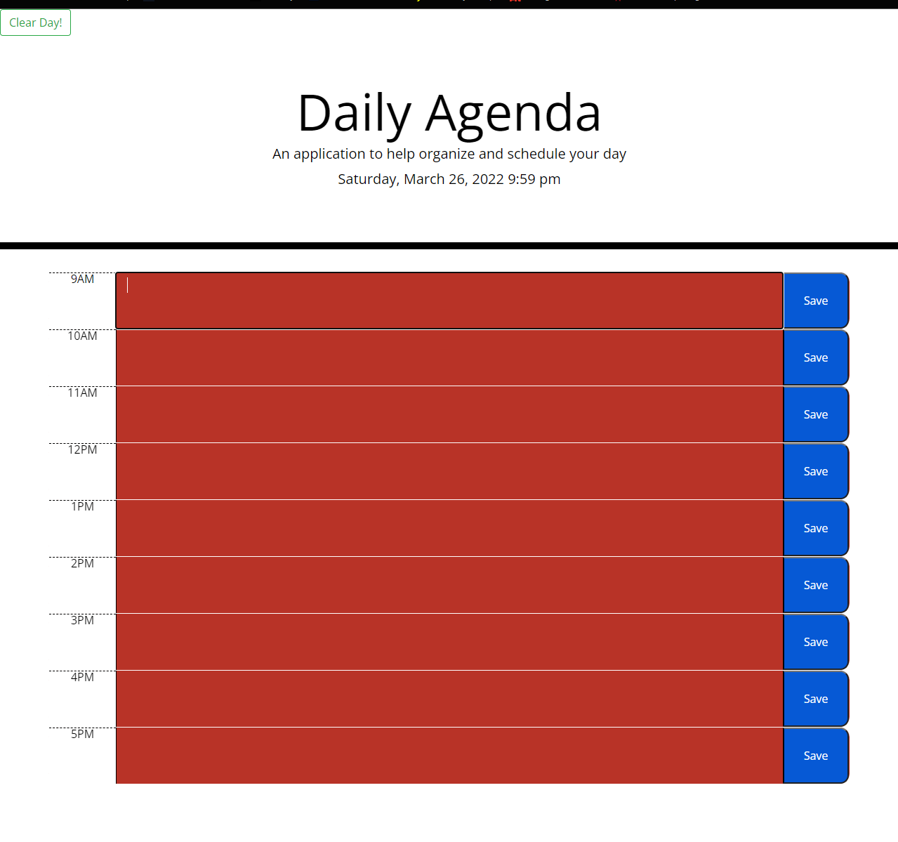

# Note Saver 3000 # 
# Description 
This is a Daily Agenda application that allows the user to save the notes and then clear all notes.
while using Moment.js to get the current date and time so the application can update as the day goes by. \
[Link For Deployed Site](https://cyrescooper.github.io/work-day/)\
\

